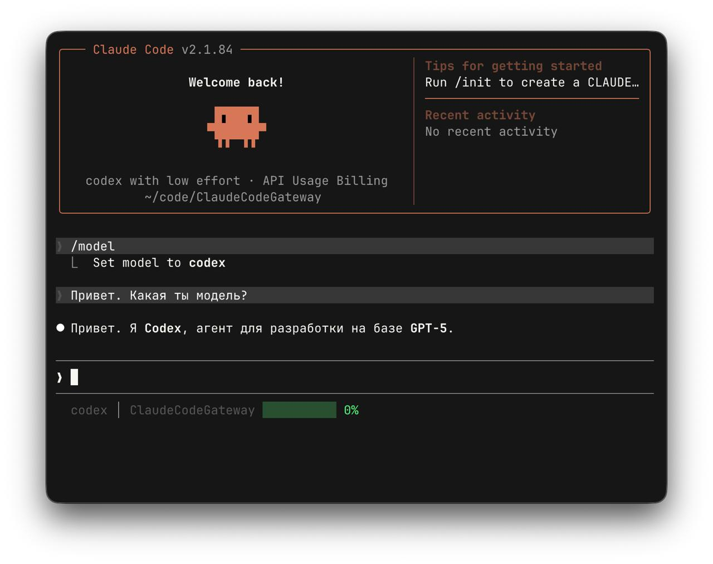

# Claude Code Gateway

[English](README.md) | [Русский](README.ru.md)



Легковесный персональный gateway для **Claude Code**. Позволяет использовать модели Anthropic вместе с **OpenAI GPT-5.3 Codex** и **Google Gemini 3.1** в одном окружении.

## Старт Для Новичков

Если вообще не хочется разбираться в деталях, просто выполните в Terminal одну команду:

```bash
curl -fsSL https://raw.githubusercontent.com/EgorYolkin/ClaudeCodeGateway/main/bootstrap.sh | bash
```

Дальше следуйте подсказкам. Если попросит ключ, вставьте `ANTHROPIC_API_KEY`.

После завершения установки:

```bash
source ~/.zshrc
claude
```

Готово.

## Быстрая Проверка

- Откройте Claude Code и выполните `/model`
- Должны быть пункты:
  - Sonnet (Original)
  - Opus (Original)
  - GPT-5.3 Codex (слот Haiku)
  - Gemini 3.1 (Custom слот)

## Возможности

- Нативная установка на macOS через `LaunchAgent` (без Docker)
- Гибридная маршрутизация: Anthropic + Codex CLI + Gemini CLI
- Effort-логика для Codex и Gemini
- Локальный gateway с учетом токенов и usage

## Маппинг Моделей

| Слот в Claude Code | Модель | Бэкенд |
| :--- | :--- | :--- |
| Sonnet | Claude 3.5 Sonnet | Anthropic Proxy |
| Opus | Claude 3 Opus | Anthropic Proxy |
| Haiku (переименован) | GPT-5.3 Codex | `codex` CLI |
| Custom (пункт 5) | Gemini 3.1 | `gemini` CLI |

## Варианты Установки

### Рекомендуемый

```bash
curl -fsSL https://raw.githubusercontent.com/EgorYolkin/ClaudeCodeGateway/main/bootstrap.sh | bash
```

### Ручной

```bash
git clone git@github.com:EgorYolkin/ClaudeCodeGateway.git
cd ClaudeCodeGateway
chmod +x install.sh
./install.sh
```

## Конфигурация

- Локальный URL: `http://127.0.0.1:8080`
- Логи: `/tmp/claude-gateway.log`
- Ошибки: `/tmp/claude-gateway.err`
- LaunchAgent plist: `~/Library/LaunchAgents/com.user.claude-gateway.plist`

Полезные переменные для bootstrap:

- `CCG_INSTALL_DIR` — путь установки
- `CCG_BRANCH` — установка другой ветки
- `CCG_REPO_URL` — свой URL репозитория

## Если Что-То Не Работает

1. Проверьте `/tmp/claude-gateway.err`
2. Проверьте, что в `.env` есть `ANTHROPIC_API_KEY`
3. Перезагрузите shell: `source ~/.zshrc`
4. Повторно запустите установку

## Документы Проекта

- [Code of Conduct](CODE_OF_CONDUCT.md)
- [Contributing](CONTRIBUTING.md)
- [Security](SECURITY.md)
- [Support](SUPPORT.md)

## License

Файл лицензии пока не опубликован в репозитории.
